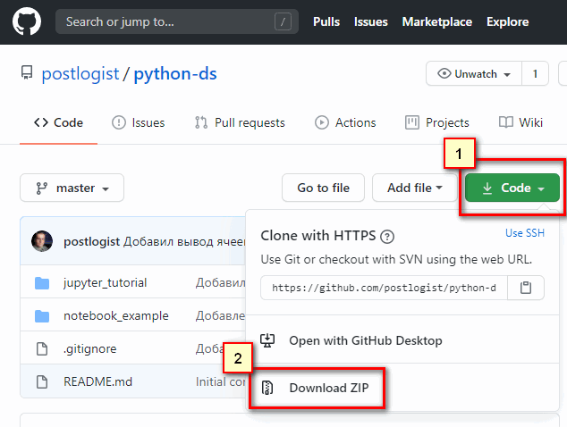

# Материалы курса Введение в Data Science (на Python)

В этом репозитории содержатся данные и примеры для курса "Введение в Data Science" для студентов ОП "Управление логистикой и ЦП"

Вы можете скачать все файлы сразу, нажав на кнопку Clone or Download/Download ZIP вверху страницы. Поскольку материалы будут регулярно обновляться, рекомендуем загружать каждый раз свежую версию.

